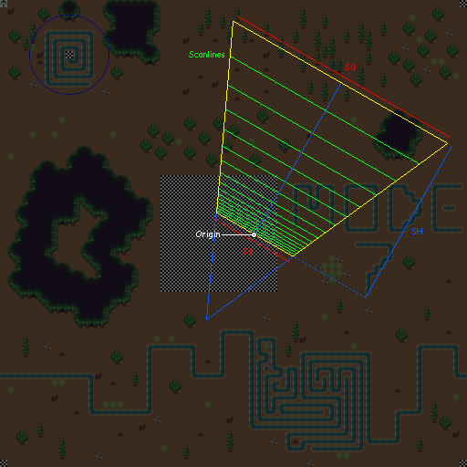
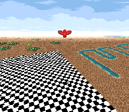

# Dizworld

This is a demonstration of how to do a few practical Mode 7 effects for the SNES.

I wanted to show how these are written, and provide example code for anyone that could use it.
If you find it helpful, please feel free to build on it, and let me know if you make anything cool.
(See license below.)

* ROM: [dizworld.sfc](../../../raw/main/dizworld/dizworld.sfc)
* Website: [rainwarrior.ca](https://rainwarrior.ca)
* Patreon: [rainwarrior](https://patreon.com/rainwarrior)

## Demos

There are 4 demonstrations, selected by the 4 buttons A, B, X, Y.
It will start in demo Y by default.

* **A**, **B**, **X**, **Y** - select demo
* **START** - toggle stats
* **SELECT** - toggle TV aspect ratio adjustment

Each of these demos shows a different way of using the Mode 7 tilemap texture.

In each demo, a **red triangle** demonstrates how a location on the texture can be mapped to its on-screen pixel position.

### Demo A "Boss"

* **D-pad** - move view
* **L/R** - scale
* **START** - pause spin / show stats

By placing mode 7's pivot point (M7X, M7Y) at the centre of an object on the tilemap,
you can spin or scale that object around the pivot point.

Otherwise the object can be moved around in screen-space with the scroll position (M7HOFS, M7VOFS).

The red triangle shows how you might pin a sprite to a location on the object.

This could be useful for a boss character, or other object, that needs to move around and spin or squish.

### Demo B "Tank"

* **D-pad** - left/right to rotate,  up/down to move
* **L/R** - scale

By moving the scroll (M7GOFS, M7VOFS) in lock step with the pivot point (M7X, M7Y),
you can spin or scale the world around a focal point.

This might be used for something like Contra 3's overhead stage.

### Demo X "Tilt"

* **D-pad** - move player
* **L/R** - tilt

Using HDMA to create a perspective scaling, we can give the appearance of walking on a tilted plane.

This is similar to Final Fantasy IV's airship view.

### Demo Y "Flyer"

* **D-pad** - left/right to rotate, up/down to move
* **L/R** - height
* **SELECT** - reset position

Using HDMA to create a perspective scaling, and rotating around a focal point,
we have a perspective plane that we can freely roam around.

This demo also lets the player's height adjust the view of the perspective,
and also shows a sky and horizon effect.

This is similar to F-Zero's race view, or the world maps in many Squaresoft RPGs.

## Technical Notes

Mode A and B are fairly simple and have a low CPU cost.

Mode X and Y have a very high CPU cost when the HDMA tables need to be regenerated,
though as seen in this example there is still enough CPU power to do this at 60fps.
Note that you can move the origin without needing to rebuild the HDMA tables,
only changing the rotation or perspective parameters requires a rebuild.

The texel-to-screen examples given are written in a relatively "generic" way,
and have a high cost of computation. I think for a game that needs to do a lot of this
transformation with heavy action, they could be adapted in a purpose-built way
that is much faster. There are some notes about this in the source code.

Keep in mind that Pilotwings and Mario Kart both had a DSP chip to do the computation work.
The basic SNES is still fully capable of doing these calculations, but at higher CPU cost,
so it might be difficult to have as many 3D-positioned sprites as those games did,
at the same framerates.

The perspective view maps a trapezoid from the tilemap texture to the screen.
This defines a view frustum in terms of **S0**, **S1**, **SH**, an origin point, and a rotation angle.
Diagram and its approximate in-game view:

The HDMA tables are generated at a level of precision that was selected to get
good real-time performance from the SNES. If your game doesn't need to rotate
and primarily uses one viewing angle/zoom, it might be worthwhile to pre-generate
your HDMA tables at a higher precision. There are comments in the source code
that might help with pre-generating a more accurate table, if this applies.

I also did an experiment increasing the precision of the inner loop calculation
at run-time. It looks a little better, though it's not very suitable for 60fps
gameplay. If you'd like to take a look, the branch with ROM is
here: [16-bit precision test](../../../tree/dizworld_16bit_precision/dizworld/#readme)

Some useful links:
* [NovaSquirrel Mode 7 Previewer](https://novasquirrel.github.io/Mode7Preview/) - an excellent webpage tool allowing you to write a javascipt program to generate a Mode 7 view per-scanline.
* [Telinc1 Mode 7 Simulator](https://telinc1.github.io/mode7/) - a simpler webpage tool showing more directly how the Mode 7 registers operate.
* [Kulor's Guide to Mode 7 Perspective Planes](https://forums.nesdev.org/viewtopic.php?t=24053) - a recent forum thread with fertile discussion about how to create Mode 7 perspective effects.
* [Wikipedia: Texture mapping - Perspective correctness](https://en.wikipedia.org/wiki/Texture_mapping#Perspective_correctness) - a description of the perspective correction calculation.

## Build

* [cc65](https://cc65.github.io/) - used to build the ROM.
* [python 3](https://www.python.org/) - (optional) used to checksum the ROM and rebuild the graphics data.
* [PILLOW](https://pillow.readthedocs.io/) - (optional) python library package used to rebuild the graphics data.

1. Download the "Windows Snapshot" of **cc65** and unzip it to a "cc65" folder within this one.
2. Run **build.bat** to build the ROM.

The source graphics are PNG images. These can be rebuilt into SNES data by the **gfx.py** python script.

The **dizworld.png** image was created with the free
[Tiled](https://www.mapeditor.org/) map editor.
The map source for that image is **dizworld.tmx**.
The PNG file does not need to be made with Tiled, but since Mode 7 maps are made of 8x8 tiles,
it was helpful for laying it out, and making sure we didn't exceed the limit of 256 unique tiles.

## License

This program was written by Brad Smith.
Its source code is made freely available under the the terms of the Creative Commons Attribution license:
[CC BY 4.0](ttps://creativecommons.org/licenses/by/4.0/)

This means that you may reuse and modify this code as long as you give credit to its original author.

The visual art incorporated in this demo came from several authors under Creative Commons licenses. These were all sourced from
[OpenGameArt.org](https://opengameart.org/):

* **16x16 Forest Tiles by Sharm**: [OpenGameArt: 16x16-forest-tiles](https://opengameart.org/content/16x16-forest-tiles) (CC BY 4.0)
* **Ocean Background by KnoblePersona**: [OpenGameArt: ocean-background](https://opengameart.org/content/ocean-background) (CC BY 3.0)
* **LPC Birds by bluecarrot16**: [OpenGameArt: lpc-birds](https://opengameart.org/content/lpc-birds) (CC BY 4.0)
